# Screenshot comparisons — Elk on Lynx vs original Elk

Both columns are captured at 390×844 (mobile viewport) against the **same
live instance (mas.to)** minutes apart: the left column is this example
running on **Lynx for Web** (`dist/main.web.bundle` inside
`@lynx-js/web-core`'s `<lynx-view>`), the right column is the original
**elk.zone** in Chromium. Because both talk to a live timeline, the posts
shown differ — compare the anatomy, not the content.

Captured with the scripts in [`../harness/`](../harness/). See
[PORTING.md](../PORTING.md) for what was reused vs rebuilt.

| Surface | Elk on Lynx | Original Elk (elk.zone) |
| --- | --- | --- |
| Local timeline | 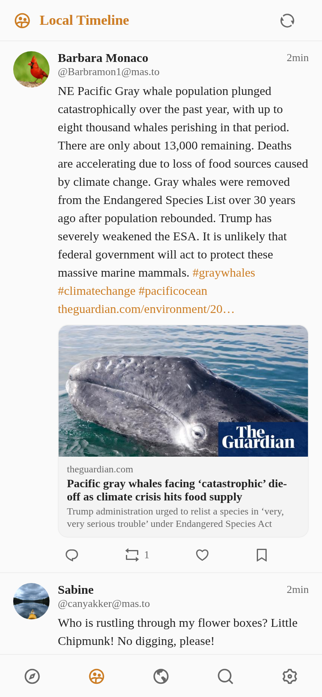 | 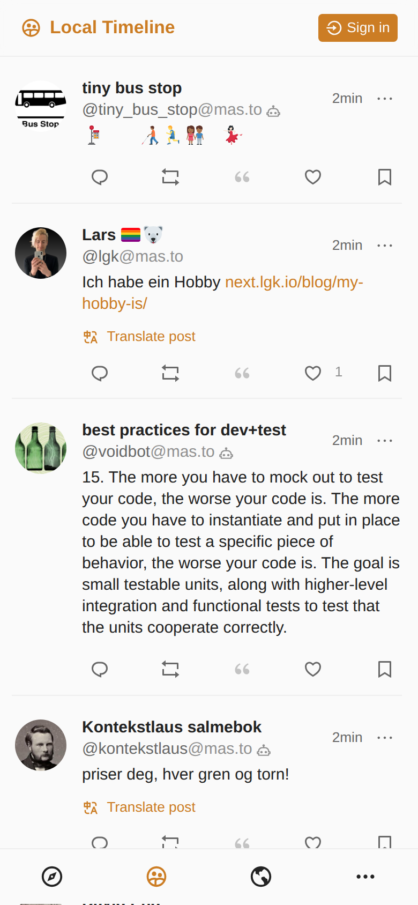 |
| Federated timeline | 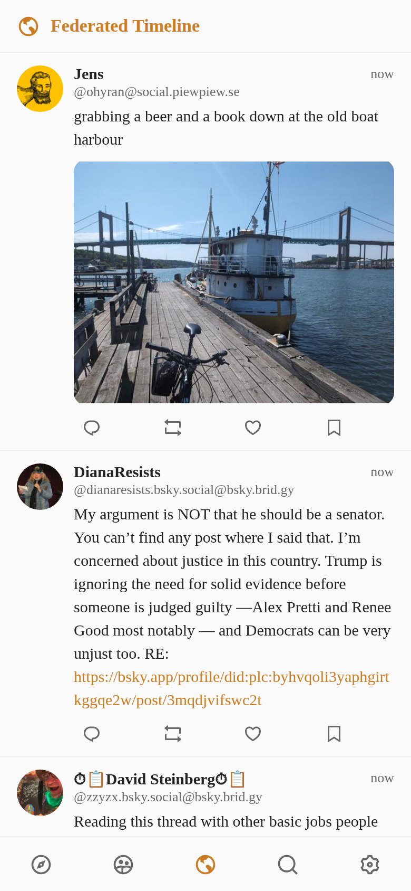 | 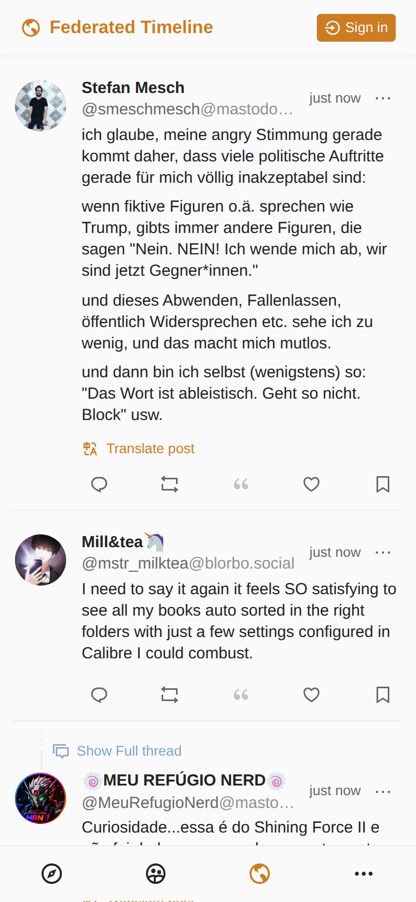 |
| Explore — trending posts | 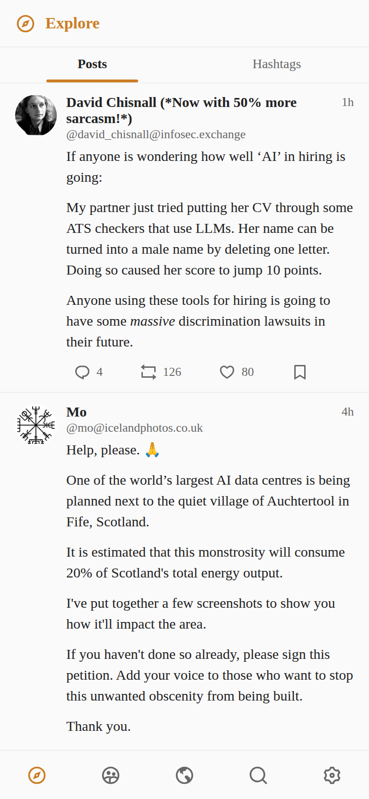 | 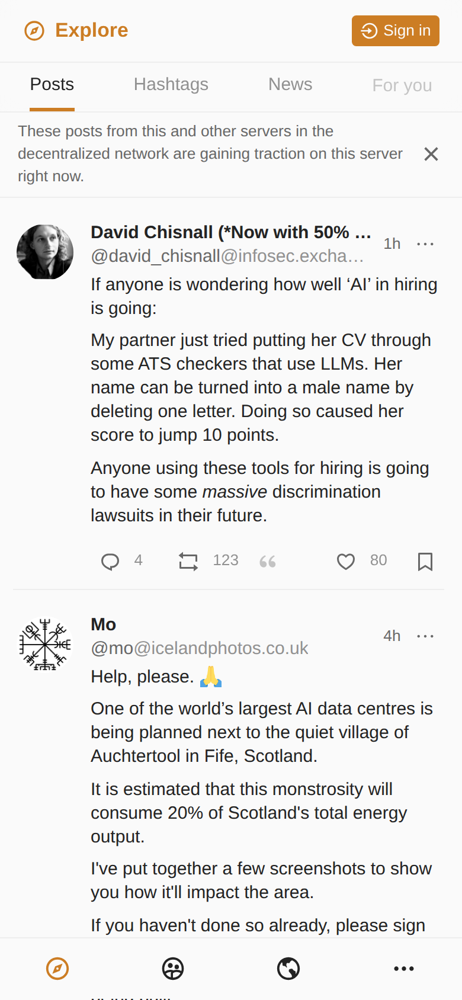 |
| Explore — trending hashtags | 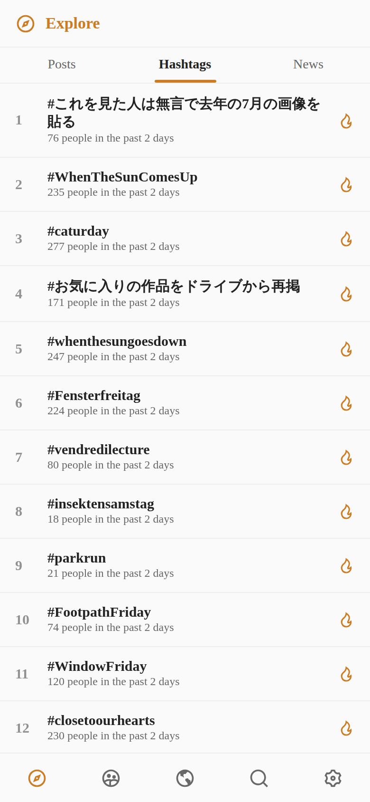 | 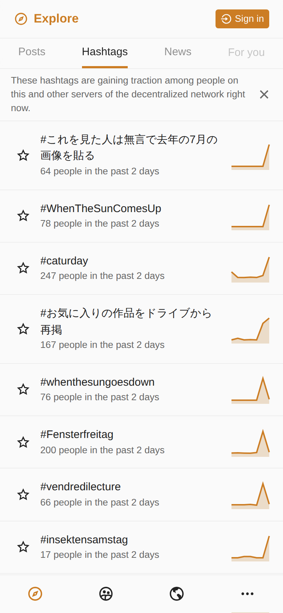 |
| Search ("vuejs") | 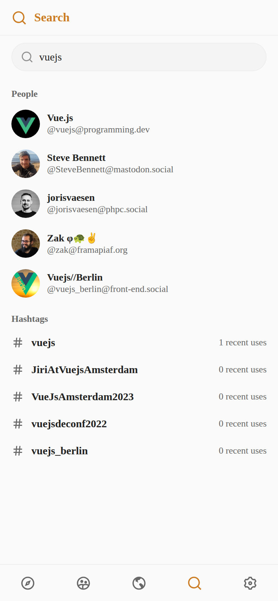 | 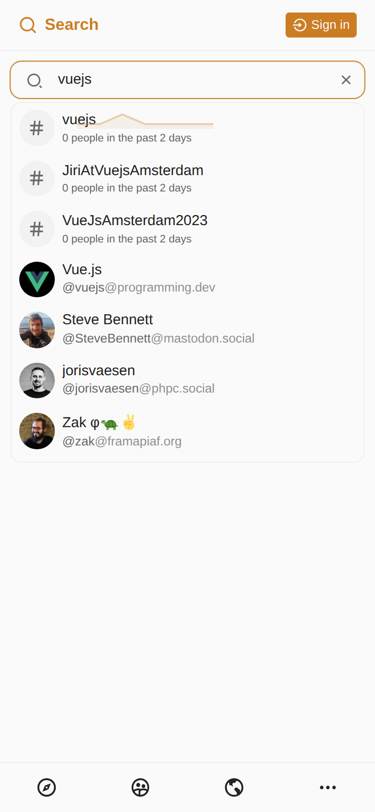 |
| Settings | 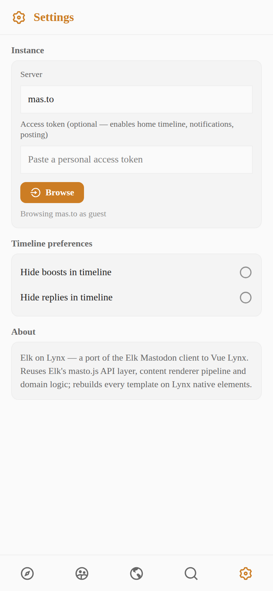 | 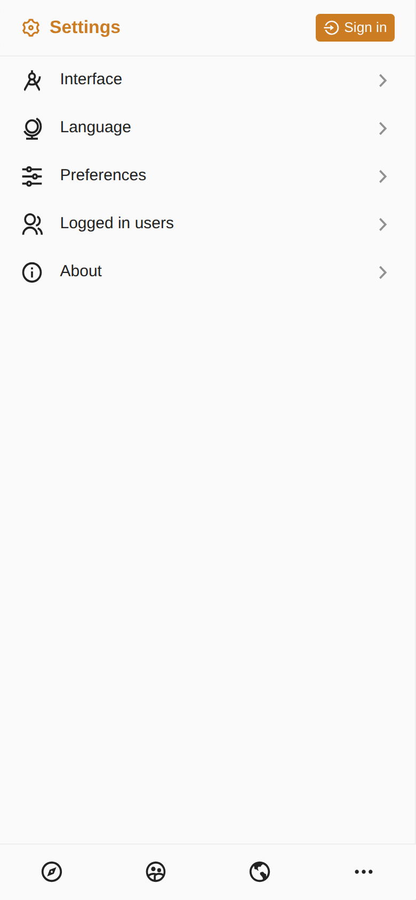 |
| Thread / status detail |  |  |
| Account profile | 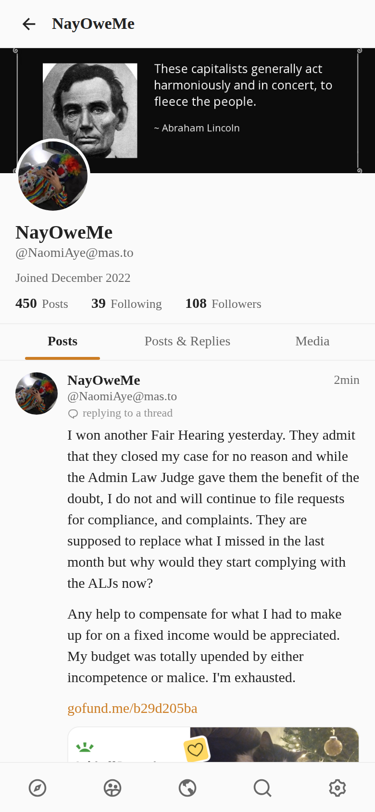 |  |
| Dark mode |  | 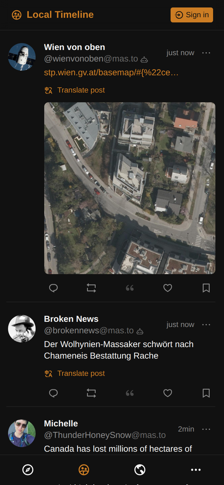 |

Lynx-only captures (no same-frame Elk counterpart):

| Surface | Elk on Lynx |
| --- | --- |
| Fullscreen media preview | 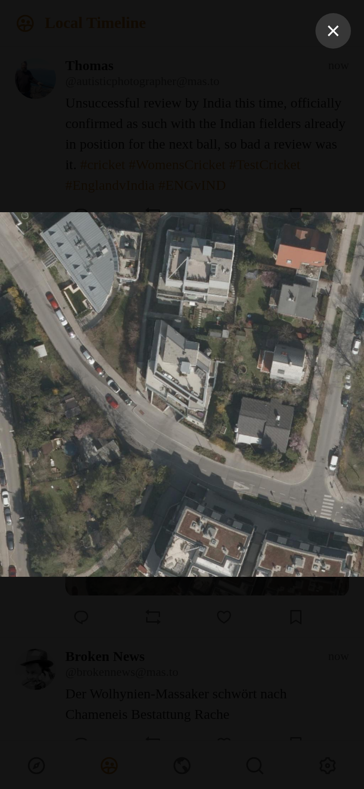 |
| Hashtag timeline | 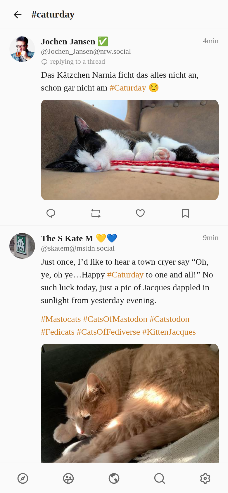 |
| Trending news (explore) | 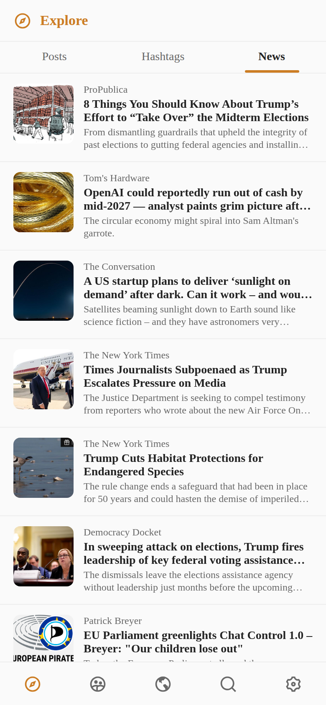 |
| Edit history + quote post | 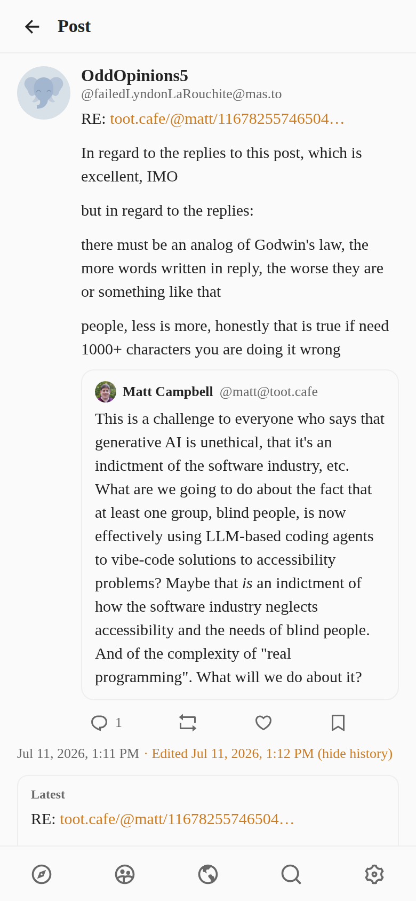 |

## Known visual deltas (intentional or tracked)

- The guest header now mirrors Elk's **Sign in** action, but routes to the
  token-based Settings flow because this example has no OAuth server.
- Elk's action bar includes a **quote** button (Mastodon 4.5); the port
  renders quote posts (see the edit-history capture) but composing quotes
  is out of scope with the editor.
- Elk renders unicode emoji as twemoji images; the port uses native color
  emoji glyphs (deliberate — see PRD "Content rendering").
- Elk's guest bottom nav has 4 items (…-menu last); the port promotes
  Search and Settings into the bar.
- The port follows Elk's system sans stack; glyph rasterization still differs
  slightly between Chromium and the native iOS text renderer.
